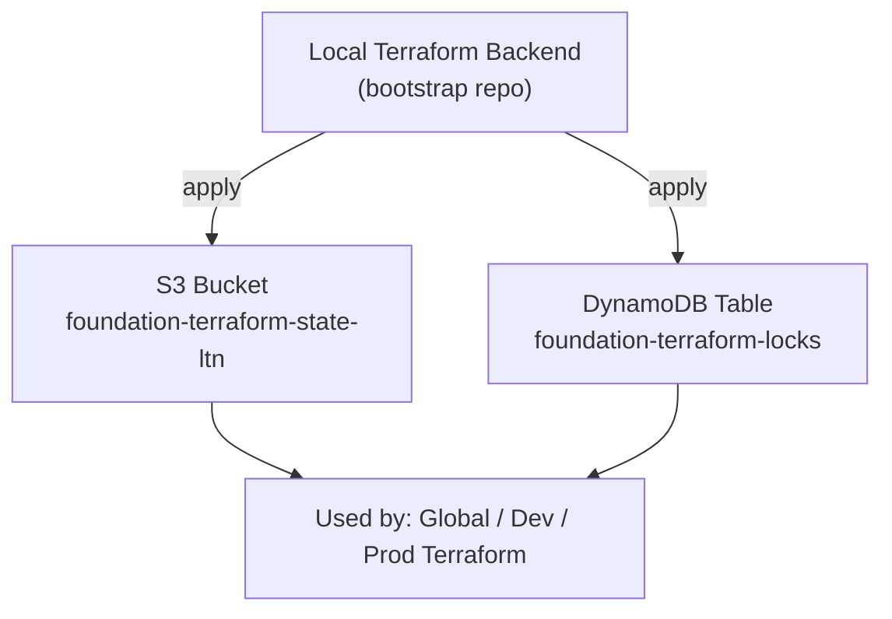

# AWS Terraform Backend Bootstrap
This repository bootstraps the **Terraform backend infrastructure** for all environments.  
It creates a **single shared S3 state bucket** and a **DynamoDB locking table**, following modern AWS + Terraform best practices.

## Overview
Terraform cannot create its own backend before the backend exists.  
Therefore, this repository uses a **local backend** and deploys:

### Created resources:
- S3 bucket for Terraform state  
- S3 versioning (state history & state recovery)
- S3 server-side encryption (AES256)
- S3 public access block (fully restricted)
- DynamoDB table for Terraform state locking

After applying this repo once, **all other Terraform projects** (global, dev, prod, etc.) use this backend automatically.

---

## Why the S3 bucket includes a suffix (`-ltn`)
S3 bucket names must be **globally unique across all AWS accounts worldwide**.  
This means that:

> If any AWS user in the world already created a bucket with the same name,  
> you will not be able to create it — even in your own AWS account.

To guarantee global uniqueness and keep the name professional, this project uses the suffix:

```
foundation-terraform-state-ltn
```

The DynamoDB table does **not** require a suffix, because DynamoDB table names only need to be unique **within a single AWS account**, not globally.

---

## Architecture Diagram (Mermaid)



---

## File Structure
```
aws-tf-backend-bootstrap/
├── backend.tf
├── main.tf
├── versions.tf
├── providers.tf
├── variables.tf
├── outputs.tf
└── README.md
```

---

## Usage

### 1. Initialize
```
terraform init
```

### 2. Apply
```
terraform apply
```

After this, note the outputs:

- `s3_bucket`
- `dynamodb_table`

These values will be used by all other Terraform projects.

---

## Cleanup After Bootstrap (Best Practice)

This repository is used **only once** to create the Terraform backend (S3 + DynamoDB).  
After running `terraform apply`, the backend infrastructure exists permanently and no further changes are required.

To avoid storing local Terraform state for this bootstrap project, remove the state files:

```bash
rm -rf .terraform
rm -f .terraform.lock.hcl
rm -f terraform.tfstate
rm -f terraform.tfstate.backup
```

This is the recommended practice because:

- the bootstrap repository should not maintain its own state long-term  
- the backend infrastructure will not be modified again  
- future Terraform projects will use the new S3 backend  
- keeping local state for a bootstrap repo has no purpose and can cause confusion  

---

## How to use this backend in other Terraform projects

Example (**global** environment):

```hcl
terraform {
  backend "s3" {
    bucket         = "foundation-terraform-state-ltn"
    key            = "global/terraform.tfstate"
    region         = "eu-central-1"
    dynamodb_table = "foundation-terraform-locks"
    encrypt        = true
  }
}
```

Example (**dev** environment):

```hcl
key = "dev/terraform.tfstate"
```

Example (**prod** environment):

```hcl
key = "prod/terraform.tfstate"
```

All environments use:

- the same S3 bucket  
- the same DynamoDB table  
- a unique `key` per environment  

---

## Best Practices Followed

✓ Single bucket per AWS account (global S3 namespace)  
✓ Single DynamoDB table for all Terraform locks  
✓ Versioned & encrypted state (AES256)  
✓ Fully blocked public access  
✓ Local backend for safe bootstrapping  
✓ Idempotent & reproducible infrastructure  
✓ Global/Dev/Prod environments share a consistent backend  
